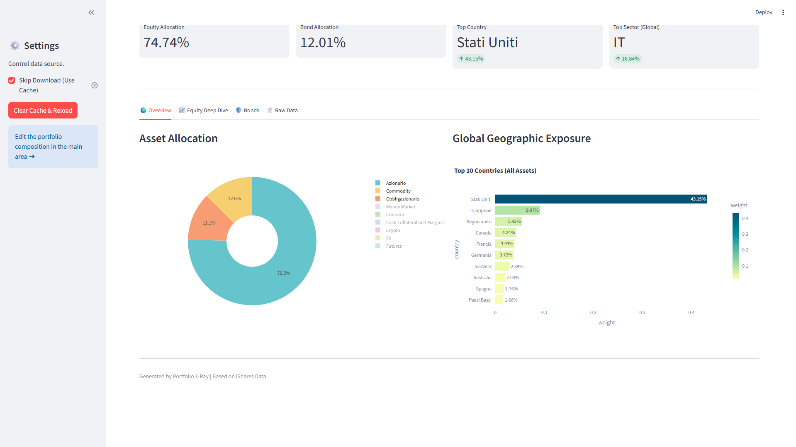
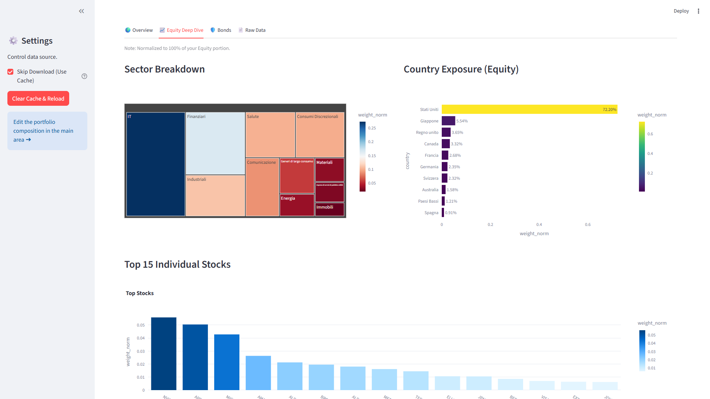
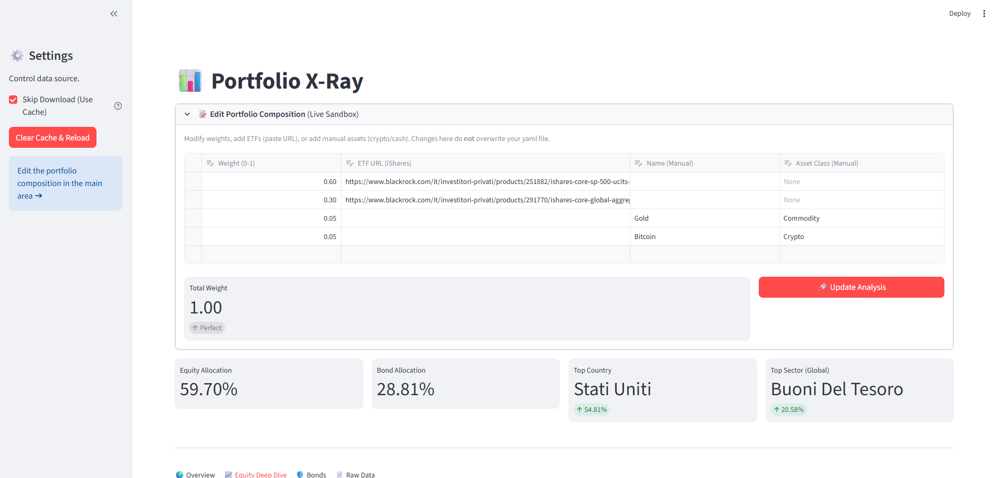

# Portfolio X-Ray 📊

**Portfolio X-Ray** is a Python-based tool designed to analyze investment portfolios with a specific focus on looking through **iShares ETFs**. It scrapes the underlying holdings from the iShares (Italy) website, aggregates them with your manual assets (Crypto, Cash, etc.), and provides a deep-dive interactive dashboard.



## ✨ Features

-   **Deep Look-Through**: Automatically downloads and parses the "Holdings" CSV files for iShares ETFs to analyze the actual underlying stocks and bonds.
-   **Smart Aggregation**: breaks down your portfolio by:
    -   **Asset Class** (Equity, Bond, Crypto, etc.)
    -   **Geography** (Country exposure across all assets)
    -   **Sector** (Technology, Financials, etc.)
    -   **Single Stock Exposure** (See your overlap in Apple, Microsoft, etc.)
-   **Interactive Dashboard**: A "lovely" Streamlit interface to visualize data.
-   **Live Sandbox**: Edit your portfolio composition directly in the dashboard to simulate changes without modifying your config file.
-   **Smart Caching**: Saves downloaded files locally to `data/raw` to avoid repeated downloads and speed up loading.



## 📂 Project Structure

-   **`dashboard.py`**: The frontend application (Streamlit). Handles the UI and interactive plotting.
-   **`portfolio_manager.py`**: The core logic. Handles scraping, CSV cleaning, parsing, and data aggregation.
-   **`portfolio.yaml`**: (Optional) Your initial portfolio configuration file.
-   **`requirements.txt`**: Python dependencies.
-   **`data/`**: Directory where raw and processed CSV files are stored.

## 🚀 Installation

1.  **Clone or download** this repository.
2.  **Install dependencies**:
    ```bash
    pip install -r requirements.txt
    ```

## ⚙️ Configuration

You can define your portfolio in `portfolio.yaml`. If the file is missing, the app will create a dummy one for you.

**Format:**

```yaml
- url: "[https://www.ishares.com/it/investitore-privato/](https://www.ishares.com/it/investitore-privato/)..." # Link to ETF page
  weight: 0.60  # 60% allocation

- name: "Bitcoin"
  asset_class: "Crypto"
  weight: 0.10  # 10% allocation

- name: "Cash"
  asset_class: "Liquidità"
  weight: 0.30  # 30% allocation
```

## 🖥️ Usage

Run the dashboard using the following command:

```bash
python -m streamlit run dashboard.py
```

*Note: On Windows, using `python -m streamlit` is often more reliable than just `streamlit`.*

### In the Dashboard:

1.  **Sidebar**: Toggle "Skip Download" to use cached data or force a fresh download from iShares.
2.  **Expandable Editor**: Click **"Edit Portfolio Composition"** to change weights or add new assets on the fly. Click **"🚀 Update Analysis"** to see the results immediately.




## ⚠️ Disclaimer

This tool relies on the specific HTML structure of the iShares Italy website. If they change their website layout, the scraper (`ISharesDownloader`) may need updating.
This tool is for informational purposes only and does not constitute financial advice.